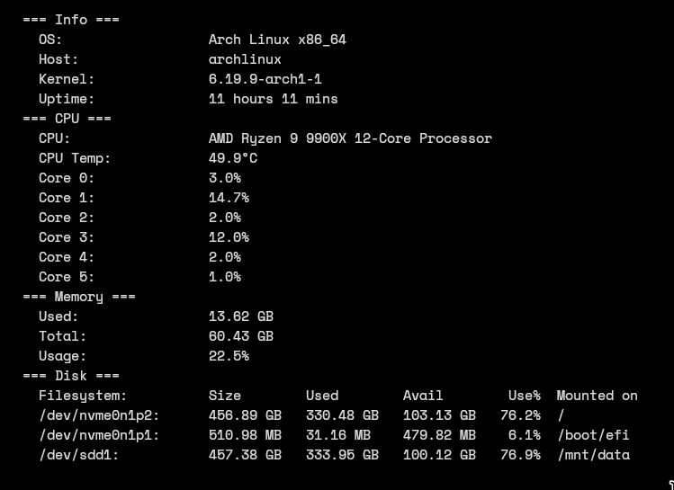

# gmon

[](https://aur.archlinux.org/packages/gmon)

A lightweight, cross-platform system resource monitor for the terminal, written in Go.



## Features

- Real-time monitoring with live refresh
- CPU usage per core + temperature
- Memory usage
- Disk partitions and usage
- System info (OS, hostname, kernel, uptime)
- Cross-platform: Linux, macOS, Windows

## Installation

### Arch Linux (AUR)

```bash
yay -S gmon
```

### From source

```bash
git clone https://github.com/rainblower/gmon
cd gmon
go build -o gmon .
```

### Pre-built binaries

Download from the [releases page](https://github.com/rainblower/gmon/releases) for your platform:

| Platform | File |
|---|---|
| Linux amd64 | `gmon_linux_amd64` |
| Linux arm64 | `gmon_linux_arm64` |
| macOS amd64 | `gmon_darwin_amd64` |
| macOS arm64 | `gmon_darwin_arm64` |
| Windows amd64 | `gmon_windows_amd64.exe` |
| Windows arm64 | `gmon_windows_arm64.exe` |

## Usage

```
gmon [flags]
```

| Flag | Short | Description |
|---|---|---|
| `--info` | `-i` | Show system info |
| `--cpu` | `-c` | Show CPU info |
| `--memory` | `-m` | Show memory info |
| `--disk` | `-d` | Show disk info |
| `--realtime` | `-r` | Real-time monitoring |
| `--version` | `-v` | Show version |

### Examples

```bash
# Real-time dashboard (all metrics)
gmon

# One-shot output for all metrics
gmon -i -c -m -d

# CPU only, real-time
gmon -c -r

# Memory and disk snapshot
gmon -m -d
```

## Building for all platforms

```bash
./build.sh
```

Binaries are placed in `./build/`.

## Supported platforms

| OS | amd64 | arm64 |
|---|---|---|
| Linux | ✓ | ✓ |
| macOS | ✓ | ✓ |
| Windows | ✓ | ✓ |

## Requirements

- Go 1.22+

## Dependencies

- [gopsutil](https://github.com/shirou/gopsutil) — system metrics
- [cobra](https://github.com/spf13/cobra) — CLI framework
- [bubbletea](https://github.com/charmbracelet/bubbletea) — TUI framework
- [lipgloss](https://github.com/charmbracelet/lipgloss) — terminal styling

## License

MIT
